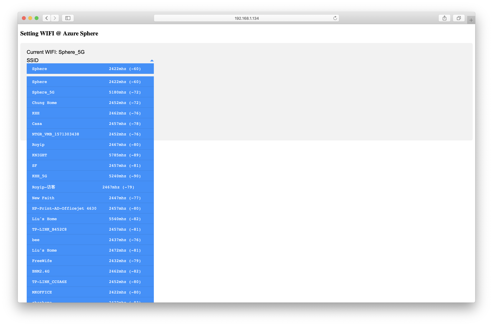
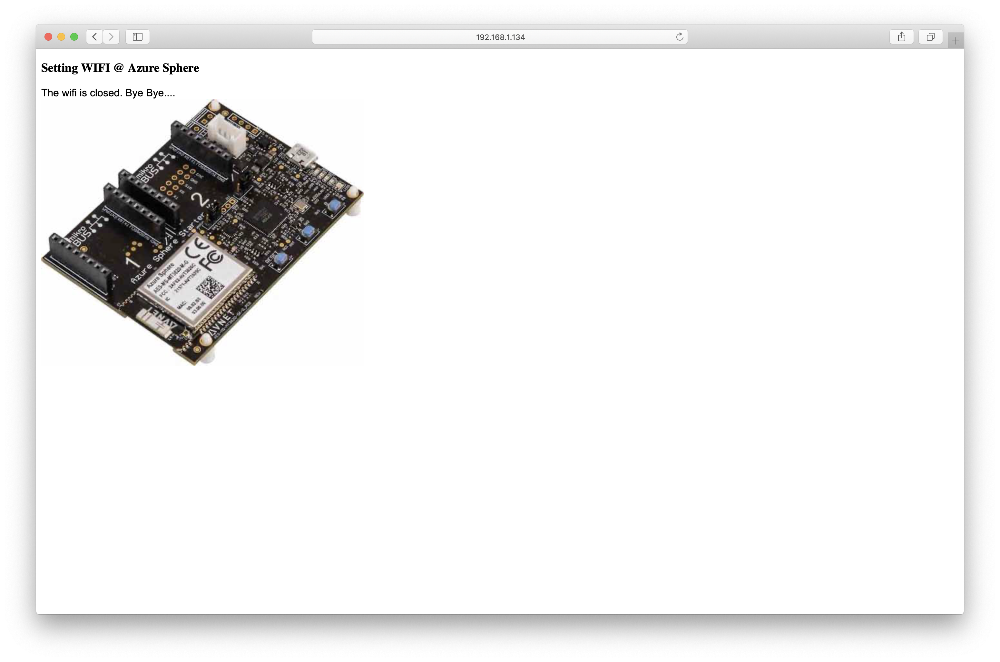

# A simple web server for Azure Sphere
## w/ demo for change wifi setting via web server

## Install 
Simple clone it and complie at visual studio.

## Running 
The programe start at SSID: **First** and Open network (No password), 
so the device try to connect to AP as open network with SSID **First**.

Change of WIFI network is easy, just access ip:8080 on browser, select new network, put psk password and click submit.

To Reset the wifi, click **REMOVE**.

## Web Server
The web server support GET method to receive feedback from client, relative code should wrote inside **web_interact** 
function at web_tcp_server.c, two array **get_name** and **get_value** for GET parameters with **filename** and **filetype**
support for custom data, also with a **str_replace** class for easy modify of html documents, 
html content *<!!!---%s* will be replaced by the string specified.

html and relative resources should inserted under visual studio "Resources Files", ensure content select "true",
the Properties "Relative Path" also is the path of web server.

The web server support htm/html/txt, and image jpg/gif, as well as compression document such as zip.

Due to restrict of memory, file should smaller that about 35kb, otherwise will easy to SIGKILL (out of memory).

